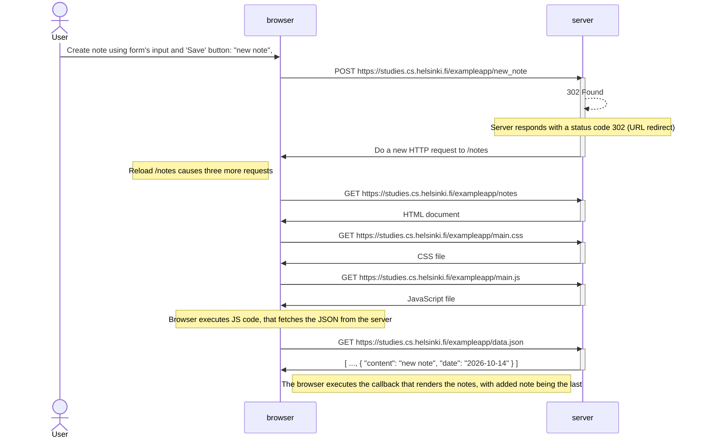

```mermaid
sequenceDiagram
    actor User
    participant browser
    participant server

    User->>browser: Create note using form's input and 'Save' button: "new note",
    browser->>server: POST https://studies.cs.helsinki.fi/exampleapp/new_note
    activate server
    server-->>server: 302 Found
    Note over server: Server responds with a status code 302 (URL redirect)
    server->>browser: Do a new HTTP request to /notes
    deactivate server

    Note left of browser: Reload /notes causes three more requests
    browser->>server: GET https://studies.cs.helsinki.fi/exampleapp/notes
    activate server
    server->>browser: HTML document
    deactivate server

    browser->>server: GET https://studies.cs.helsinki.fi/exampleapp/main.css
    activate server
    server->>browser: CSS file
    deactivate server

    browser->>server: GET https://studies.cs.helsinki.fi/exampleapp/main.js
    activate server
    server->>browser: JavaScript file
    deactivate server
      Note over browser: Browser executes JS code, that fetches the JSON from the server

    browser->>server: GET https://studies.cs.helsinki.fi/exampleapp/data.json
    activate server
    server->>browser: [ ..., { "content": "new note", "date": "2026-10-14" } ]
    deactivate server

    Note right of browser: The browser executes the callback that renders the notes, with added note being the last
```
