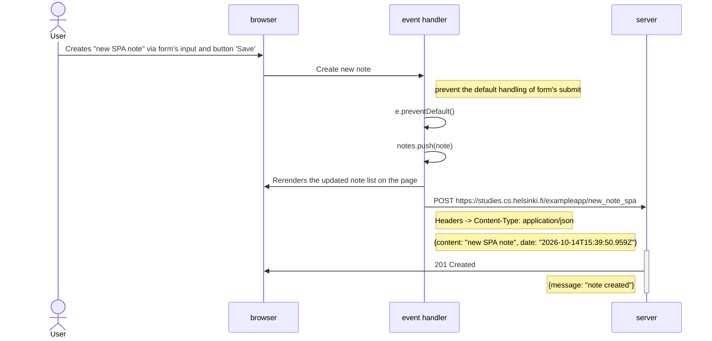

```mermaid
sequenceDiagram
    actor User
    participant browser
    participant event handler
    participant server

    User->>browser: Creates "new SPA note" via form's input and button 'Save'
    browser->>event handler: Create new note
        Note right of event handler: prevent the default handling of form's submit
    event handler->> event handler:  e.preventDefault()
    event handler ->> event handler: notes.push(note)
    event handler->>browser: Rerenders the updated note list on the page
    event handler->>server: POST https://studies.cs.helsinki.fi/exampleapp/new_note_spa
Note right of event handler: Headers -> Content-Type: application/json
    Note right of event handler: {content: "new SPA note", date: "2026-10-14T15:39:50.959Z"}
    activate server
    server->>browser: 201 Created
    Note left of server: {message: "note created"}
    deactivate server

```
